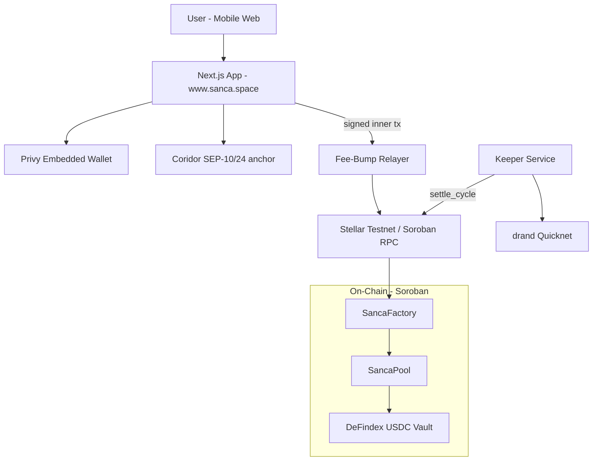

# Sanca

**Composable community savings on Stellar — ROSCA mechanics powered by DeFindex yield, drand randomness, and ecosystem integrations.**

> APAC Stellar Hackathon 2026 · Track: **DeFi & Ecosystem Composability**

[](https://www.sanca.space)
[](https://stellar.expert/explorer/testnet)
[](https://soroban.stellar.org)

**Tagline:** *Community savings that earns — built on Stellar DeFi building blocks, not from scratch.*

---

## Live Demo

| Resource | Link |
|----------|------|
| **Live App** | [https://www.sanca.space](https://www.sanca.space) |
| **Factory (testnet)** | [`CBOYFEB3KN4WOZVSIC5QPEM6KJTQRDH4IW6WUT6QK4QZPPWHPUABBGR7`](https://stellar.expert/explorer/testnet/contract/CBOYFEB3KN4WOZVSIC5QPEM6KJTQRDH4IW6WUT6QK4QZPPWHPUABBGR7) |
| **Video Demo** | [Youtube](https://youtu.be/feCH4332wEE?si=f30Wf0ZUIIv7TZd7) |
| **Pitch Deck** | [Canva](https://canva.link/5bt3h9k42pci320) |

---

## Problem

Across APAC — Indonesia (arisan), Philippines (paluwagan), Vietnam (hụi) — **hundreds of millions of people** save together in community circles (ROSCAs). It is one of the oldest financial primitives in the region.

Yet informal circles still fail on trust:

- Organizers can disappear with pooled funds
- Members default on contributions with no enforcement
- Idle pooled money earns nothing
- Winner selection feels unfair or opaque
- Crypto-native tools are unusable for everyday community members

**ROSCA is real. The infrastructure to run it fairly and productively on-chain is not.**

---

## Solution

**Sanca** is a consumer-facing savings circle app that **composes existing Stellar infrastructure** instead of rebuilding DeFi from zero.

Members join a circle, lock collateral, contribute each cycle, and one winner receives the pot plus a **yield bonus**. Collateral sits in a **DeFindex USDC vault** and earns while the circle runs. Winner order is shuffled with **drand verifiable randomness**, verified on-chain via BLS12-381 (CAP-0059).

Users log in with email/social (Privy), fund with IDR via **Coridor SEP-10/24 anchor**, and never need XLM — a **fee-bump relayer** covers network fees.

---

## Why DeFi & Ecosystem Composability?

Sanca is not a standalone vault or a generic wallet. It is a **composable consumer protocol** that wires together Stellar building blocks into a new financial primitive: **yield-bearing ROSCA**.

| Layer | What Sanca uses | What Sanca builds |
|-------|-----------------|-------------------|
| **DeFi** | DeFindex USDC vault (deposit, redeem, PPS) | Per-member vault share ledger inside `SancaPool` |
| **Stablecoins** | Blend USDC SAC + classic trustline | Collateral lock, cycle payouts, liquidation |
| **Smart contracts** | Soroban factory + pool pattern | ROSCA lifecycle: join → contribute → settle → withdraw |
| **Randomness** | drand quicknet beacon | On-chain BLS verify + Fisher-Yates winner shuffle |
| **Wallet** | Privy embedded Stellar wallet | Email/social login, `rawSign` for Soroban txs |
| **On/off-ramp** | Coridor SEP-10/24 anchor | IDR ↔ Blend USDC (VA, QRIS, OVO) — same issuer as pools |
| **Fees** | Stellar fee-bump pattern | Relayer so users with 0 XLM can transact |

**Composable value:** Users do not "use DeFindex" or "use drand" directly — they join a savings circle. Under the hood, Sanca gives **real USDC utility**: earn, disburse, compound, and liquidate through existing protocols.

---

## How It Works (User Flow)

```
Login (Privy) → Top up IDR (Coridor SEP-10/24 anchor) → Join circle → Collateral → DeFindex vault
     ↓
Each cycle: contribute USDC → keeper settles with drand → winner gets pot + yield bonus
     ↓
All cycles done → withdraw remaining collateral + compounded vault shares
```

### ROSCA economics (example)

```
10 members × 10 USDC/week = 100 USDC pot per cycle
Collateral per member = 10 × 10 = 100 USDC (locked in DeFindex on join)
Winner each cycle: 100 USDC pot + ~90% of vault yield earned that cycle
After all cycles: members withdraw their vault share (minus any liquidation)
```

---

## Stellar Ecosystem Benefit

1. **DeFindex adoption** — Real consumer volume into PaltaLabs vaults via ROSCA collateral, not just DeFi natives.
2. **Stablecoin utility** — Blend USDC is locked, yielded, disbursed, and redeemed through meaningful recurring activity.
3. **Soroban depth** — Multi-contract system (factory, pool, cross-contract vault calls, on-chain BLS verification).
4. **Composability template** — Shows how to build APAC consumer finance by plugging into wallets, ramps, and DeFi instead of isolating.
5. **drand on-chain** — Demonstrates verifiable randomness for fair disbursement in consumer apps.
6. **Fee abstraction** — Relayer pattern lowers friction for non-crypto users on Soroban.

---

## Viability & Go-to-Market

Sanca is designed to reach real community savers, not only crypto-native users.

### First pilot (post-hackathon, Q3 2026)

**Target:** one live savings circle in **Yogyakarta, Indonesia** — either a small **RT/neighbourhood arisan** (5–10 members, weekly contributions) or an **online community** the team already moderates (Discord/Telegram group with existing trust and a fixed contribution habit).

**Why this cohort:** they already run informal ROSCAs today; Sanca replaces the organizer-held cash box with on-chain enforcement, without asking members to learn wallets or seed phrases.

### Revenue model (on-chain today)

Fees are encoded in `SancaFactory` / `SancaPool` — not manual off-chain billing:

| Parameter | Value | Meaning |
|-----------|-------|---------|
| `yield_split_bps` | **9000** (90%) | Share of vault yield paid to the cycle winner as bonus |
| `platform_fee_bps` | **1000** (10%) | Sanca's cut of that yield bonus, transferred on each `settle_cycle` |
| Pool creation fee | **0** (hackathon) | Planned **0.1 USDC** per pool on mainnet |

**Example:** If available vault yield for a cycle is 1 USDC → **0.9 USDC** allocated as yield bonus (`yield_split_bps = 9000`). Sanca platform fee = **0.09 USDC** (10% of that bonus); winner receives **0.81 USDC** yield bonus + cycle pot. Principal is untouched — Sanca earns on **yield**, not member savings.

Relayer gas is **platform-subsidized** during onboarding so new users are not blocked by XLM requirements.

### Long-term GTM

1. **Community-led growth** — circle creators invite their own groups (RT, kantor, kampus, online communities); no cold-start liquidity needed.
2. **Yield-aligned revenue** — platform revenue scales with TVL in DeFindex vaults and circle activity, not one-time signup fees.
3. **APAC expansion** — same ROSCA primitive maps to paluwagan (PH) and hụi (VN) with localized ramp partners.
4. **Grants & partnerships** — SCF follow-on for mainnet audit; DeFindex / anchor partnerships for distribution.

---

## Architecture



---

## Testnet Deployment

| Component | Testnet Address / Endpoint |
|-----------|----------------------------|
| **SancaFactory** | `CBOYFEB3KN4WOZVSIC5QPEM6KJTQRDH4IW6WUT6QK4QZPPWHPUABBGR7` |
| **Blend USDC SAC** | `CAQCFVLOBK5GIULPNZRGATJJMIZL5BSP7X5YJVMGCPTUEPFM4AVSRCJU` |
| **Blend USDC Issuer** | `GATALTGTWIOT6BUDBCZM3Q4OQ4BO2COLOAZ7IYSKPLC2PMSOPPGF5V56` |
| **DeFindex USDC Vault** | `CBMVK2JK6NTOT2O4HNQAIQFJY232BHKGLIMXDVQVHIIZKDACXDFZDWHN` |
| **Soroban RPC** | `https://soroban-testnet.stellar.org` |
| **Coridor SEP-10/24 anchor** | `sep.coridor.fun` · widget `api.coridor.fun` |

### Verified on-chain lifecycle

```bash
cd contracts
./scripts/full_lifecycle_test.sh
```

Covers: deploy → 3 members join → DeFindex deposit → 3× `settle_cycle` with live drand + on-chain BLS → liquidation scenario → per-member `withdraw`.

**22 unit tests** in `sanca-pool` (join, contribute, settle, drand/BLS, yield, liquidation, withdraw).

---

## Composability Detail

### DeFindex integration

- On `join()`, pool deposits member collateral into DeFindex vault and mints dfTokens to the **pool contract**
- `MemberVaultShares` maps each member's share of the pool's vault position
- On liquidation: redeem vault shares from **defaulter only**
- On yield payout: proportional share deduction across all members
- On `withdraw()`: member redeems their own vault shares after pool completion

### drand integration

- Keeper fetches latest drand quicknet beacon
- `settle_cycle(round, sig_uncompressed, sig_compressed)` verifies BLS12-381 on-chain (CAP-0059)
- Randomness seed = `SHA256(compressed_signature)` → Fisher-Yates shuffle of winner order

### Wallet + fee abstraction

- Privy: email / Google login → embedded Stellar G-address
- User signs inner Soroban transaction; relayer wraps in fee-bump (whitelist: `create_pool`, `join`, `contribute`, `withdraw`)

### Coridor SEP-10/24 anchor (same USDC issuer)

- IDR deposit/withdraw via SEP-24 interactive widget (VA, QRIS, OVO)
- Blend USDC issuer matches pools — **no swap** after top-up

---

## Tech Stack

| Layer | Technology |
|-------|------------|
| Frontend | Next.js 16, TypeScript, Tailwind, shadcn/ui |
| Wallet | Privy (`@privy-io/react-auth`) |
| Contracts | Rust, `soroban-sdk`, WASM `wasm32v1-none` |
| Yield | DeFindex USDC vault (SAC) |
| Randomness | drand quicknet + on-chain BLS12-381 |
| Backend | Node.js keeper + relayer |
| Ramp | Coridor SEP-10/24 anchor |
| Network | Stellar testnet, Soroban RPC |

---

## Repo Structure

| Path | Description |
|------|-------------|
| `app/`, `components/`, `hooks/`, `lib/` | Next.js frontend |
| `contracts/` | `sanca_factory`, `sanca_pool` Soroban contracts |
| `keeper/` | Auto `settle_cycle` when cycle ends |
| `relayer/` | Fee-bump service for user transactions |
| `docs/PRD.md` | Full product requirements |

---

## Quick Start (Local)

### 1. Frontend

```bash
cp .env.example .env.local
# Set NEXT_PUBLIC_PRIVY_APP_ID, NEXT_PUBLIC_FACTORY_ADDRESS, etc.
npm install
npm run dev
```

### 2. Relayer

```bash
cd relayer
cp env.example .env   # RELAYER_SECRET, FACTORY_ADDRESS
npm install
npm start
```

### 3. Keeper

```bash
cd keeper
cp env.example .env   # FACTORY_ADDRESS, KEEPER_SECRET
npm install
npm run set-keeper    # one-time: factory admin sets keeper
npm start
```

### 4. Contracts

```bash
cd contracts
./scripts/deploy.sh
./scripts/full_lifecycle_test.sh
```

Requires funded Stellar CLI identities (`sanca-deployer`, `sanca-member*`) with XLM + testnet USDC.

---

## Judging Criteria Mapping

| Criterion | Weight | How Sanca addresses it |
|-----------|--------|------------------------|
| Technical implementation & Stellar usage | 25% | Soroban factory/pool, DeFindex cross-contract calls, on-chain BLS drand, fee-bump relayer, 22 contract tests, full lifecycle script |
| Real-world fit & use case | 25% | ROSCA/arisan — widespread APAC community savings; clear target user (community groups, not crypto natives) |
| Innovation / differentiation | 20% | Yield-bearing ROSCA + verifiable randomness + composable stack; not a clone vault or payment app |
| UX & accessibility | 5% | Privy login, no seed phrase, no XLM required, Bahasa Indonesia UI |
| Viability & go-to-market | 10% | See [Viability & Go-to-Market](#viability--go-to-market) |
| Team & ability to continue | 5% | Substantial codebase across contracts, services, and frontend; post-hackathon roadmap below |

---

## Team

| Member | Role | Social |
|--------|------|--------|
| Tegar Aji Kurniawan | Smart contracts, keeper, relayer, integrations | [LinkedIn](https://www.linkedin.com/in/tegaraji) |
---

## Roadmap

### Hackathon (Jul 2026)
- [x] Soroban ROSCA contracts on testnet
- [x] DeFindex vault integration + per-member share accounting
- [x] drand on-chain BLS verification
- [x] Privy embedded wallet + fee-bump relayer
- [x] Coridor SEP-10/24 anchor (Blend USDC)
- [x] **Demo video**
- [x] **Pitch deck**

### Post-hackathon
- Mainnet deployment + security review
- Yogyakarta pilot: 1 RT or online community circle
- SAC receipt token (wallet-visible vault share)
- Fixed calendar cycle schedule (v2 contract)
- Passkey smart account upgrade path

---

## Submission Checklist (APAC Hackathon)

**Done:**

- [x] Public GitHub repo with detailed README
- [x] Live app deployed (testnet-backed): [www.sanca.space](https://www.sanca.space)
- [x] Smart contracts deployed on Stellar testnet
- [x] Video demo [Youtube](https://youtu.be/feCH4332wEE?si=f30Wf0ZUIIv7TZd7)
- [x] Pitch deck [Canva](https://canva.link/5bt3h9k42pci320)

---

## Documentation

- [Product Requirements (PRD)](docs/PRD.md)
- [Contract Deployment](contracts/DEPLOYMENT.md)
- [Keeper Service](keeper/README.md)
- [Relayer Service](relayer/README.md)

---

## License

MIT — see [LICENSE](LICENSE).
